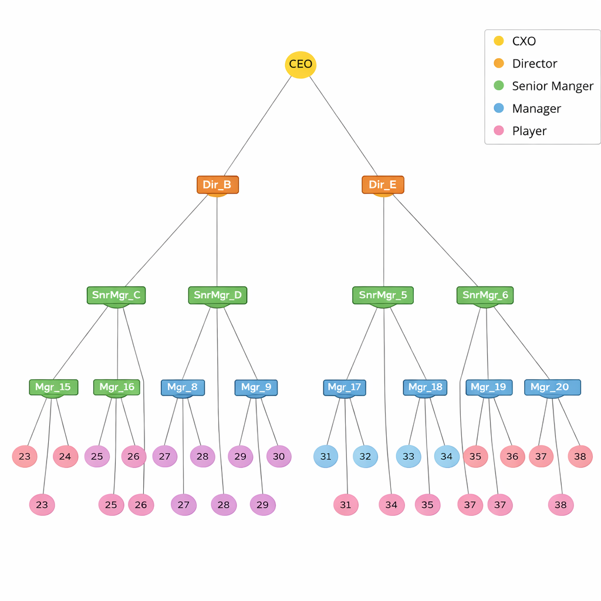
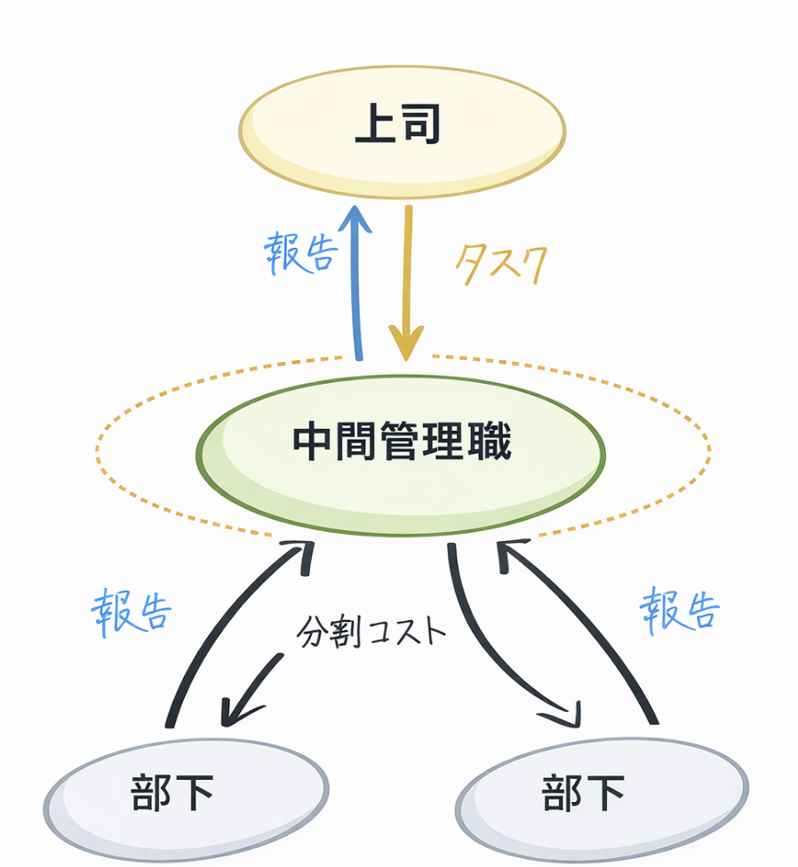
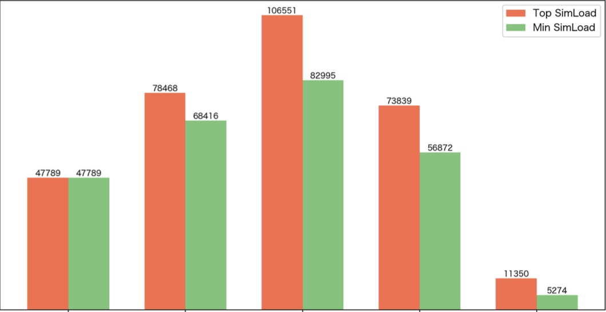

<!-- _class: lead -->
# 中間管理職の負荷問題に関する組織構造研究

**黒川 良太**
古谷研究室所属

2026年1月

---

## 背景

<div class="columns">

<div>

### 社会問題
- 「若者の出世離れ」、「中間管理職がしんどい」
- 単なる業務量だけではなく増大する認知コスト
</div>
<div>

### サンドイッチ状態

```
[上位層]

   ↓ 戦略的指示

[中間管理職]

   ↑ 報告・相談

[現場層]
```
</div>
</div>

---

## 提案手法の全体図



### エージェントベースシミュレーション

**組織と活動をグラフを用いてモデル化**

- 5層階層組織
  - CXO, Director, SeniorManager(SM), Manager(Mgr), Player
- 総ノード数：約25,000
- タスクが組織内を移動・処理
- 2000ステップの検証
- 負荷（負荷）を定量化

---

## TaskAgentの構成要素

<div style="font-size: 0.8em;">

| 要素 | 説明 | 備考 |
|:----|:---|:---|
| **w** | タスク重み | 初期値：難易度6~10, 関係者数4~8 |
| **状態** | 生成, 移動, 処理/分割, 報告 | CXO生成 → SM分割 → Plyr実行 |
| **ルール** | 各層で異なる生成確率 | CXO: 20%確率, DIR: 40%確率 |


</div>

---

## タスクフローについて



### タスクの流れ

**1. 上位層でタスク生成**
**2. 中間層で分割・委譲**
**3. 実行層で処理**
**4. 報告が上位へ集約**
### 負荷集中のメカニズム
**分割 + 委譲 + 報告集約 → 中間管理職に集中**

---

## 負荷の計算方法


<div class="columns">
<div>

### 負荷要因と係数

| 負荷要因 | 係数 | 説明 |
|:---:|:---:|:---|
| タスク受信 | 1.0 × w | 基準負荷 |
| タスク送信 | 0.3 × w | 委譲コスト |
| 報告受信 | 0.1 × w | 確認コスト |
| 分割コスト | 0.2 × w | 判断コスト |

</div>

<div>

### 計算式


**負荷 = Σ（w）**

**全期間の累積値**

</div>

</div>

---

## 実験設計：ベースモデル

<div class="columns" style="font-size: 0.85em;">
<div>

### InterviewBasedシナリオ

| 階層 | 管理スパン | 人数 |
|:---|:---:|---:|
| CXO→Dir | 15-20 | - |
| Dir→SM | 10-15 | 238 |
| **SM→Mgr** | **10-15** | - |
| Mgr→Player | 5-10 | - |

**総ノード数：約25,000**

</div>
<div>

### ベースモデルシミュレーション結果



役職別の最大・最小・平均負荷
➡️ **SMに最大負荷が集中**

</div>
</div>

---

## 実験設計：実験A・B

<div class="columns" style="font-size: 0.75em;">
<div>

### 実験A：効率化（SM人数固定）

| 階層 | 管理スパン | 人数 |
|:---|:---:|---:|
| CXO | 15-20 | - |
| Dir | 10-15 | **238** |
| **SM** | **10-15→4-6** | - |
| Mgr | **5-10→18-22** | - |
| Player | - | - |

**狙い**: 1人あたり効率向上
**総ノード数**: 約25,000

</div>
<div>

### 実験B：分散化（SM人数増加）

| 階層 | 管理スパン | 人数 |
|:---|:---:|---:|
| CXO | 15-20 | 1 |
| **Dir** | **10-15→18-23** | **238→398** |
| **SM** | **10-15→4-6** | - |
| Mgr | 5-10 | - |
| Player | - | - |

**狙い**: 総負荷の分散
**総ノード数**: 約25,000

</div>
</div>

---

## 結果：絶対値での比較

<div style="font-size: 0.8em;">

| 指標 | Baseline | 実験A | 実験B |
|:---|---:|---:|---:|
| **SM人数** | 238 | 238 | 398 <span style="color: red;">(+67%)</span> |
| **SM平均負荷** | 94,420 | 81,562 <span style="color: blue;">(-14%)</span> | 74,369 <span style="color: blue;">(-21%)</span> |
| **Mgr平均タスク数** | 56,625 | 139,376 <span style="color: red;">(+146%)</span> | 83,313 <span style="color: red;">(+47%)</span> |

</div>

### 結果

- **両実験でSM負荷は減少**
- ただし、**Mgrの負荷が増加**（特に実験A）
- 負荷の遷移が発生

---

## 正規化評価方法の説明

### なぜ正規化が必要か？

人数が異なる実験を公平に比較するため

### 正規化負荷の計算

```
正規化負荷 = SM平均負荷 / SM平均タスク処理数
```

**意味**：1タスクあたりの処理効率

- **値が小さい** → 効率が良い
- **値が大きい** → 効率が悪い

---

## 結果：正規化での比較

<div style="font-size: 0.85em;">

| 指標 | Baseline | 実験A | 実験B |
|:---|---:|---:|---:|
| **SM正規化負荷** | 2.67 | 2.19 <span style="color: blue;">(-18%)</span> | 3.21 <span style="color: red;">(+20%)</span> |

</div>

### 結果の解釈

<div style="font-size: 0.9em;">

| 実験 | 絶対負荷 | 効率 | 解釈 |
|:---:|:---:|:---:|:---|
| **A** | 減少 | 向上 | 効率的に負荷削減 |
| **B** | 減少 | 低下 | 人数増で分散したが非効率 |

</div>

---

## 考察①：結果から得られた知見

<div style="font-size: 0.85em;">

### 1 管理スパン削減の有効性

両実験でSM→Mgr管理スパン削減によりSM負荷が減少

### 2 トレードオフの存在

<div class="columns">
<div>

**実験A：効率 vs 負荷遷移**
- SM効率18%向上
- Mgr負荷146%増加

</div>
<div>

**実験B：負荷削減 vs 効率低下**
- 総負荷21%削減
- 1人あたり効率20%低下

</div>
</div>

</div>

---

## 考察②：実務への示唆

<div class="columns" style="font-size: 0.8em;">
<div>

### 実験A（効率化）を選ぶべき状況

**選択条件**
- Mgr層に余裕がある
- 1人あたり処理効率重視
- 昇進ポストを増やしたくない


</div>
<div>

### 実験B（分散化）を選ぶべき状況

**選択条件**
- 昇進ポスト増でキャリアパス充実
- Mgr層の負荷増加を避けたい
- 絶対的な負荷削減を最優先

</div>
</div>

### 本質的な制約

**組織の総業務量は一定** 
➡️ **特定層だけの削減は不可能だと理解した上で組織全体でのヒアリングや検証が必要**